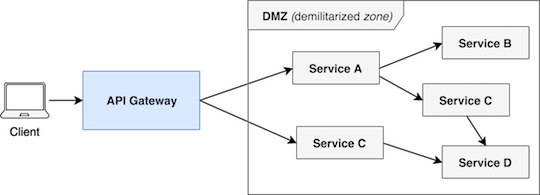
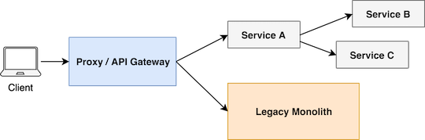

# What is an API Gateway?

API Gateway is a type of service in a microservice architecture which provides a shared layer and API for clients to communicate with internal services. The API Gateway can **route requests**, transform protocols, **aggregate data** and implement shared logic like authentication and rate-limiters.

> source: [What is an API Gateway?][What-is-an-API-Gateway-def]

You can think about API Gateway as the entry point to our microservices world.
Our system can have one or multiple API Gateways, depending on the client's requirements. For example, we can have a separate gateway for desktop browsers, mobile applications and public API(s) as well.

 API Gateway as an entry point to microservices 

[What-is-an-API-Gateway-def]: https://blog.risingstack.com/building-an-api-gateway-using-nodejs/

## Node.js API Gateway for frontend teams

As API Gateway provides functionality fo client applications like browsers - it can be implemented and managed by the team who is responsible for the frontend application.

As JavaScript is the primary language to develop applications for the browser, Node.js can be excellent choice to implement an API Gateway even if your microservices architecture is developed in a different language.

For example: Netflix successfully uses Node.js API Gateway with their Java backend to support a broad range of clients.

Netflix’s approach to handle different clients

## API Gateway functionalities

### Routing and versioning

In your gateway service, you can route requests form a client to specific services.
You can even handle versioning during routing or change the backend interface while the publicly exposed interface can remain the same. You can also define new endpoints in your API gateway that cooperates with multiple services.

API Gateway as microservices entry point

### Evolutionary design

The API Gateway approach can also help you to break down your monolith application.

_In most of the cases rewriting your system from scratch as a microservices is not a good idea and also not possible as we need to shop features for the business during the transition._

In this case, we can put a proxy or an API Gateway in front of our monolith application and implement **new functionalities as microservices** and route **new endpoint to the new services** while we can serve old endpoint via monolith. Later **we can also break down the monolith** with **moving existing functionalities into new services**.

With evolutionary design, we can have a **smooth transition** from monolith architecture to microservices.

Evolutionary design with API Gateway
