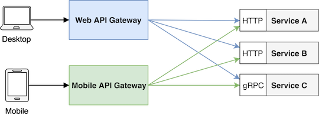
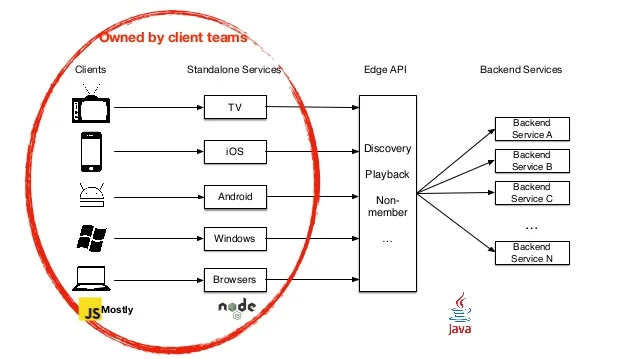
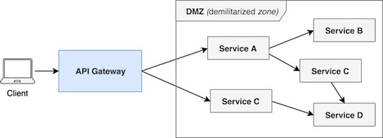
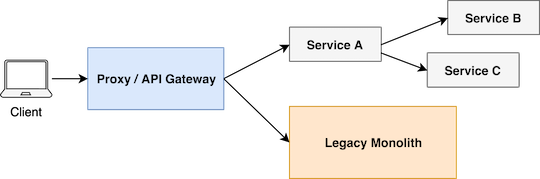
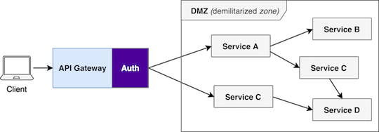
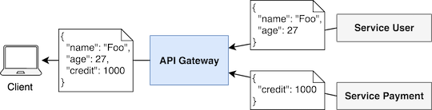
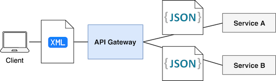
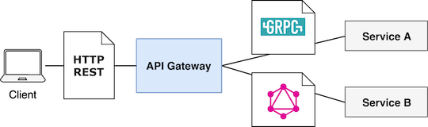

# What is an API Gateway?

API Gateway is a type of service in a microservice architecture which provides a shared layer and API for clients to communicate with internal services. The API Gateway can **route requests**, transform protocols, **aggregate data** and implement shared logic like authentication and rate-limiters.

> source: [What is an API Gateway?][What-is-an-API-Gateway-def]

You can think about API Gateway as the entry point to our microservices world.
Our system can have one or multiple API Gateways, depending on the client's requirements. For example, we can have a separate gateway for desktop browsers, mobile applications and public API(s) as well.

 API Gateway as an entry point to microservices 

[What-is-an-API-Gateway-def]: https://blog.risingstack.com/building-an-api-gateway-using-nodejs/

## Node.js API Gateway for frontend teams

As API Gateway provides functionality fo client applications like browsers - it can be implemented and managed by the team who is responsible for the frontend application.

As JavaScript is the primary language to develop applications for the browser, Node.js can be excellent choice to implement an API Gateway even if your microservices architecture is developed in a different language.

For example: Netflix successfully uses Node.js API Gateway with their Java backend to support a broad range of clients.

Netflix’s approach to handle different clients

## API Gateway functionalities

### Routing and versioning

In your gateway service, you can route requests form a client to specific services.
You can even handle versioning during routing or change the backend interface while the publicly exposed interface can remain the same. You can also define new endpoints in your API gateway that cooperates with multiple services.

API Gateway as microservices entry point

### Evolutionary design

The API Gateway approach can also help you to break down your monolith application.

_In most of the cases rewriting your system from scratch as a microservices is not a good idea and also not possible as we need to shop features for the business during the transition._

In this case, we can put a proxy or an API Gateway in front of our monolith application and implement **new functionalities as microservices** and route **new endpoint to the new services** while we can serve old endpoint via monolith. Later **we can also break down the monolith** with **moving existing functionalities into new services**.

With evolutionary design, we can have a **smooth transition** from monolith architecture to microservices.

Evolutionary design with API Gateway

### Authentication

Most of the microservices infrastructure need to handle authentication.
Putting **shared logic** like authentication to the API Gateway can help you to **keep your services small** and **domain focused**

In the microservices architecture, you can keep your service protected in a DMZ(demilitarized zone) via network configurations and expose them to clients via the API Gateway. This gateway can also handle more than one authentication method.

For example, you can support both cookie and token based authentication.

API Gateway with Authentication

### Date aggregation

We can user out API Gateway to resolve these **dependencies** and collect date from multiple services.

> In a microservices architecture, it can happen that the client needs data in a different aggregation level, like **denormalizing data** entities that take place in various microservices.

For example: In the following image you can see how the API Gateway merges and returns uer and credit information as one piece of data to the client. Note, that these are owned and managed by different microservices.

### Serialization format transformation

It can happen that we need to support clients with different data serialization format requirements.

> Imagine a situation where our microservices uses JSON, but one of our customers can only consume XML APIs. In this case, we can put the JSON to XML conversion into the API Gateway instead of implementing it in all of the microservices.

### Protocol transformation

Microservices architecture allows polyglot protocol transportation to gain the benefit of different technologies.
However most of the client support only protocol. In this case, we need to transform service protocols for the clients.

An API Gateway can also handle protocol transformation between client and microservices.

For example:

> In the next image, you can see how the client expects all of the communication through HTTP RESET while our internal microservices users gRPC and GraphQL.

### Rate-limiting and caching

In Authentication, you can also implement rate-limiting, caching and various reliability features in you API Gateway.

### Overambitious API Gateways

While implementing your API Gateway, you should avoid putting non-generic logic - like domain specific data transformation - to your gateway.

Services should always have full ownership over their date domain.
Building an overambitious API Gateway takes the control form service teams that goes against the philosophy of microservices.

This is why you should be careful with date aggregations in your API Gateway - it can be powerful but can also lead to domain specific data transformation or rule processing logic that you should avoid.

Always define **clear responsibilities** for your API Gateway and only include generic shared logic in it.

## Node.JS API Gateway

--to be continue--
